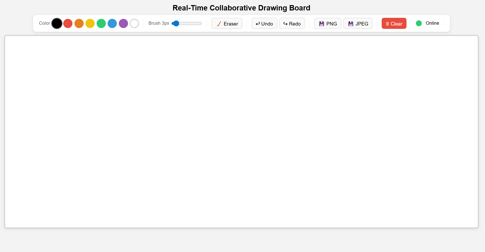
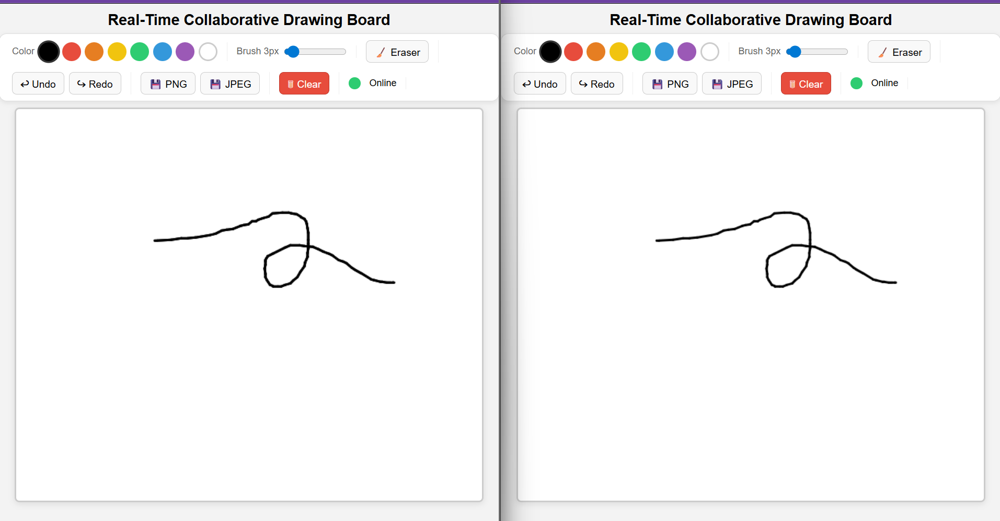
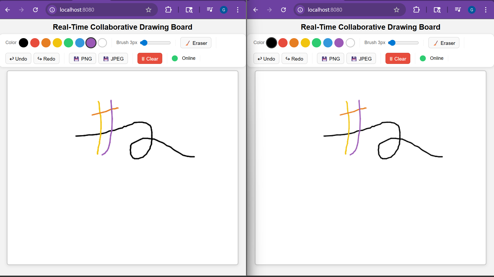
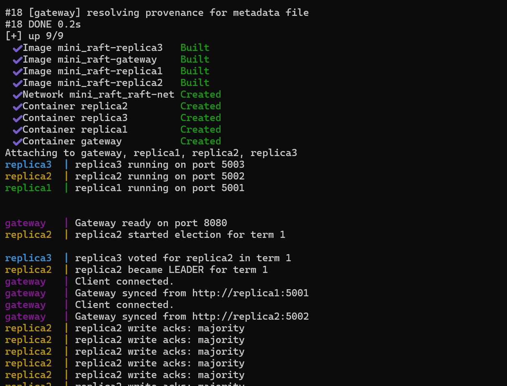
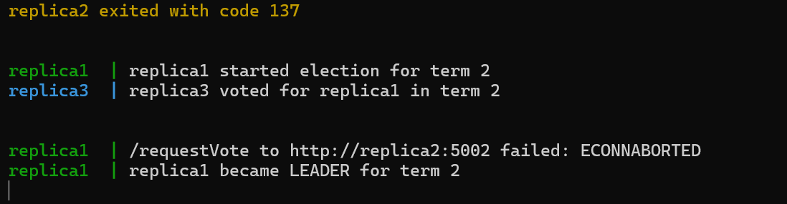

# MINI_RAFT - Real-Time Collaborative Drawing Board

MINI_RAFT is a distributed collaborative drawing board built with WebSockets, Node.js, Docker, and a Raft-style leader election flow. The browser sends drawing strokes to a gateway, and the gateway commits those strokes through a three-node replica cluster before broadcasting them back to connected clients.

## Demo Video

Add your demo media here before sharing the repository:

- Demo video: https://youtu.be/MTBbV5M58Xs

## Demo 

## Features

- Real-time collaborative drawing using WebSockets
- Gateway service that accepts browser connections
- Three replica services with Raft-style leader election
- Majority-based write replication
- Automatic failover when one replica goes down
- Docker Compose setup for a full local distributed demo

## Architecture

~~~text
Browser clients
      |
      v
WebSocket Gateway
      |
      v
Current Raft Leader
      |
      v
Follower Replicas
      |
      v
Gateway broadcasts committed strokes to all browsers
~~~

## How It Works

1. A browser connects to the gateway through WebSocket.
2. The user draws on the canvas.
3. The frontend sends the stroke to the gateway.
4. The gateway forwards the stroke to the current Raft leader.
5. The leader appends the stroke to its log.
6. The leader replicates the entry to follower replicas.
7. Once a majority accepts the entry, the stroke is committed.
8. The gateway broadcasts the committed stroke to all connected browsers.

## Tech Stack

- HTML, CSS, JavaScript
- Node.js
- Express.js
- WebSocket
- Axios
- Docker
- Docker Compose

## Run Locally

Prerequisites:

- Docker Desktop
- Git

Clone the repository:

~~~bash
git clone <your-repository-url>
cd MINI_RAFT
~~~

Start the full cluster:

~~~bash
docker compose up --build
~~~

Open the app:

~~~text
http://localhost:8080
~~~

To stop everything:

~~~bash
docker compose down
~~~

## Local Services

| Service | URL |
| --- | --- |
| Gateway | `http://localhost:8080` |
| Replica 1 | `http://localhost:5001/health` |
| Replica 2 | `http://localhost:5002/health` |
| Replica 3 | `http://localhost:5003/health` |

## Failover Demo

The cluster has three replicas, so a majority is two nodes. You can stop one replica and the remaining nodes should elect or continue with a leader.

Start the app:

~~~bash
docker compose up --build
~~~

In another terminal, stop one replica:

~~~bash
docker stop replica2
~~~

Expected behavior in the logs:

~~~text
replica1 started election
replica3 voted for replica1
replica1 became LEADER
replica1 write acks: majority
~~~

Start the stopped replica again:

~~~bash
docker start replica2
~~~

## API Health Checks

Gateway health:

~~~text
http://localhost:8080/health
~~~

Replica health:

~~~text
http://localhost:5001/health
http://localhost:5002/health
http://localhost:5003/health
~~~

## Project Structure

~~~text
frontend/       Browser UI for the drawing board
gateway/        WebSocket gateway and frontend static server
replica1/       Raft-style replica node 1
replica2/       Raft-style replica node 2
replica3/       Raft-style replica node 3
docker-compose.yml
Dockerfile
~~~

## Deployment Note

This project is designed to be demonstrated locally with Docker Compose because it runs multiple backend services. For recruiter demos, you can either share a recorded demo video or expose the local gateway temporarily using a tunnel service such as ngrok or Cloudflare Tunnel.
